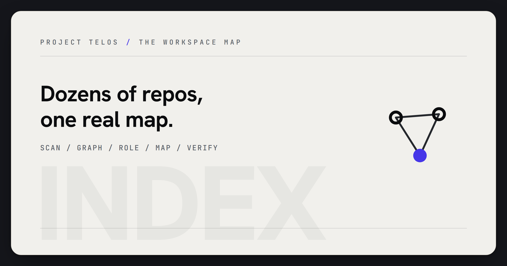
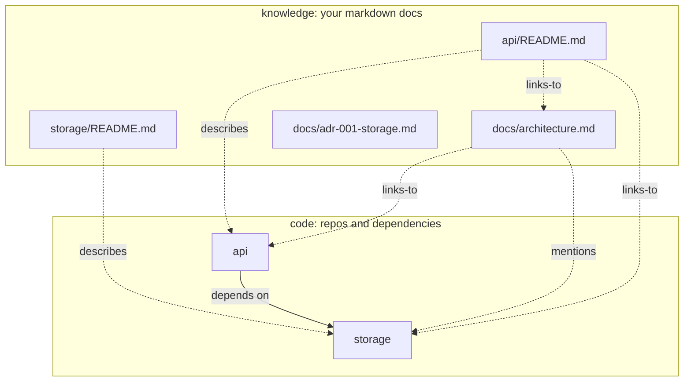
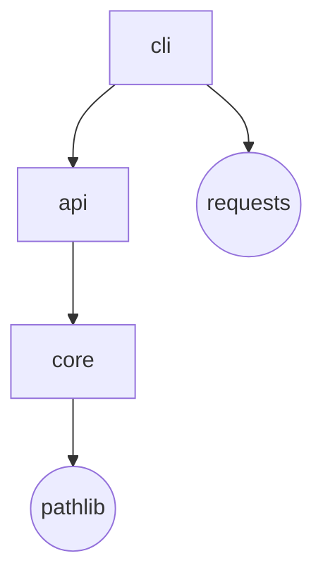

<p align="center">
  
</p>
<!-- Project mark: docs/brand/index-mark.svg -->

# index

> Map large workspaces so people and agents can find the right context.

[Project Telos](https://harperz9.github.io) | [gather](https://github.com/HarperZ9/gather) | [crucible](https://github.com/HarperZ9/crucible) | [index](https://github.com/HarperZ9/index) | [forum](https://github.com/HarperZ9/forum) | [telos](https://github.com/HarperZ9/telos) | [learn](https://github.com/HarperZ9/learn) | [emet](https://github.com/HarperZ9/emet) | [buildlang](https://github.com/HarperZ9/buildlang)

[](https://github.com/HarperZ9/index/actions/workflows/ci.yml)


[](LICENSE)

## Try it

```bash
pip install index-graph
index atlas --root /path/to/your/workspace --format html --out atlas.html
index wiki --root /path/to/one/repo --out wiki.html   # the verified single-repo wiki

# from a source checkout
python -m index status --json
```

Open the visual atlas sample at [`examples/atlas-demo.html`](examples/atlas-demo.html) or the static proof surface at [`examples/index-demo.html`](examples/index-demo.html).

## Why it matters

A workspace becomes risky when nobody can hold its shape. index gives teams and agents a map built from imports, manifests, docs, and evidence instead of memory, so context packets can cite the structure they rely on.

## Work with it

Run it on a real multi-repo workspace, use the atlas for onboarding, diligence, or agent handoffs, and test whether the context envelopes preserve enough structure for another person to resume the work.

## What to test first

- Run `index atlas` on a workspace where the architecture currently lives in someone's head.
- Open the generated map and ask whether a new contributor or agent could find the right repo, doc, and dependency edge without a handoff call.
- Report any missing edge, noisy context packet, or stale evidence pointer. The target is not a prettier graph; it is a map another run can re-check.

## Current status

- **Release:** `index-graph 2.8.0`; command `index`; Python 3.11+; zero runtime dependencies.
- **Operator surface:** `index status --json`, `index doctor --json`, `index demo --json`, and `index mcp` expose the Project Telos action envelope and native MCP tools: `index.map`, `index.context`, `index.context.envelope`, `index.select`, `index.wiki`, `index.status`, `index.doctor`, plus the existing graph, focus, verify, router, and internals tools. Generated routers now carry compact dependency evidence like `pyproject.toml:12` beside internal edges, use a fast describes-only docs pass for large workspaces, and the status payload advertises shared CLI/MCP/plugin/IDE/TUI/app contracts for enterprise, research, creative, scientific, and education workflows.
- **Current floor:** 2.8.0 covers atlas mapping, nine ecosystem resolvers, architecture certificates, freshness checks, token-economics benchmarking, selection-aware context envelopes, and MCP-native workspace intelligence.
- **Public role:** workspace map and context-envelope layer for Project Telos: index gives gather, forum, crucible, and telos a shared view of what code, docs, and dependency evidence exist now.

- **Enterprise readiness:** [docs/ENTERPRISE-READINESS.md](docs/ENTERPRISE-READINESS.md) records the large-context, action-receipt, readability, and host-integration contract for unattended agent workflows.

## What it does

Every codebase has a shape. Past a handful of repos, that shape lives only in someone's head, and they are usually busy or already gone. `index` draws it for you: how your repositories depend on each other, and the docs that explain why, as one map you can open. Built from evidence, not guesses. Zero dependencies.

Point `index` at a folder of Git repositories and it answers the question that gets harder with every repo you add. How does all of this actually fit together? It reads the dependencies the way your code already states them, an import in one file, a manifest line in another, and it records each edge with the file and line that proves it. Then `index atlas` does the part most tools skip. It pulls your markdown into the same picture, the READMEs, the ADRs, the design notes, so the explanation finally sits next to the thing it explains. What comes back is a single HTML file. No server, no build step, no account. Nothing to install but Python.

---

## Why

A program's structure is knowledge, and knowledge that lives in one person's memory is fragile. People take holidays. They switch teams. They leave. The next person rebuilds the map by grepping around, and gets it a little wrong. Meanwhile the documents that hold the reasons, why this service exists, why that dependency is allowed, sit in folders nobody opens, cut off from the code they describe.

`index` turns that map into something you can hold. It is deterministic, it regenerates on demand, and it is honest about where every line came from. People tend to reach for it in a few situations.

- You inherited a workspace you didn't write. Twenty repos, no diagram, the author long gone. One command gives you something to read on your first day.
- You run a monorepo, or a product spread across many repos. You want the dependency lanes at a glance, a cycle caught before it bites, and the doc for a service without digging through ten folders to find it.
- You maintain a lot of open source. The repos and the docs that explain them, kept as one map that regenerates the same way every time, so it never quietly drifts from the truth.
- You're writing onboarding. Hand someone a file that works offline, forever, and explains itself.

---

## 30-second quickstart

```bash
pip install index-graph

# the two-layer code and knowledge map (the headline):
index atlas --root /path/to/your/workspace --format html --out atlas.html
open atlas.html        # macOS and Linux, or: start atlas.html on Windows

# or just the repo dependency graph:
index viz --root /path/to/your/workspace --format html --out graph.html
```

Each command writes one HTML file. Open it in any browser, offline. Nothing to host, and nothing phones home.

---

## Try it in the field

`index` is the right first test when the problem is a workspace nobody can hold in their head anymore.

- **Engineering / agent routing:** map the repo graph and docs before assigning model work, so tokens go to the files and decisions that actually matter.
- **Clinical or regulated software teams:** preserve architecture evidence around the systems that touch policy, records, or review workflows.
- **Media / research teams:** keep source repos, notes, and project docs in one rerunnable atlas instead of rebuilding the map from memory.

Project Telos: <https://harperz9.github.io>. GitHub: <https://github.com/HarperZ9>. Peer flagships: [gather](https://github.com/HarperZ9/gather), [crucible](https://github.com/HarperZ9/crucible), [forum](https://github.com/HarperZ9/forum), and [the telos engine](https://github.com/HarperZ9/telos).

I am looking for verification, testing against real workspaces, early traction from people willing to inspect the certificates, and possibly modest grassroots research funding or pointers.

---

## `index wiki`, the verified wiki

The atlas maps a whole workspace. `index wiki` is the other altitude, the one-unfamiliar-repo view a newcomer actually needs. Wiki generators built on models guess your architecture and write confident prose about structure that is not there; repo packers dump source without comprehending it. `index wiki` takes the third path: it derives the wiki for ONE repo from the module dependency graph index already extracts, and then seals it so the result can be re-checked instead of trusted.

```bash
index wiki --root /path/to/one/repo --out wiki.html      # one self-contained file
index wiki --verify wiki.html --root /path/to/one/repo   # MATCH / DRIFT / UNVERIFIABLE
```

One command, one offline HTML file with client-side page navigation (or a JSON pack with `--format json`), four kinds of page:

- **Overview**: repo identity, detected ecosystems, graph-derived entry points, module count, doc inventory, and the commit SHA the wiki is pinned to.
- **Module pages**: one per module (package clusters on large repos) with imports, dependents, file paths, and cycle membership, and every edge shown carries the file:line evidence the graph recorded for it. This is also the visual render `index internals` never had.
- **Architecture**: a diagram rendered from the real dependency graph, never inferred.
- **Docs**: your existing markdown joined in verbatim, clearly labeled as authored by humans.

No model, no network, no generated prose. Every page footer states the derivation boundary, structure derived from the dependency graph plus that page's own evidence count. The artifact embeds an `index.wiki/1` manifest, the pinned commit (or "unversioned" for a non-git root), a canonical SHA-256 per page, and the generation inputs, sealed by the same hashing rule as every index certificate. `index wiki --verify` recomputes the page hashes and the graph derivation against the current tree and answers MATCH, DRIFT (a page was tampered with, a claimed edge is absent from the real graph, or the repo moved off its pinned commit), or UNVERIFIABLE, with exit codes 0/1/2. The test suite keeps the known-bad fixtures, a tampered page, a hash-consistent forged edge, hostile markdown and module names, because a verifier that cannot fail on a known-bad input is not a verifier.

---

## `index atlas`, the two-layer map

Most dependency tools stop at the code. But code is only half of what you need to understand a system. The other half is the prose that explains it, and that prose is usually stranded somewhere the graph can't see. `index atlas` brings it back in. Every markdown file becomes a node, joined to the code it documents, and you can read it without ever leaving the map.



There are four kinds of edge on the map, and the tool derives every one of them from something real. None are guessed.

| Edge | Means | Comes from |
|------|-------|------------|
| **depends-on** | repo to repo | a real import and manifest dependency, with the file:line that witnesses it |
| **describes** | doc to repo | the doc lives inside that repo's tree |
| **links-to** | doc to doc or repo | a `[[wiki-link]]` in the doc body |
| **mentions** | doc to doc or repo | the name shows up in prose (weakest, dimmed, with a toggle to hide it) |

Open the result and it behaves like a workbench, not a poster.

```text
+----------------------------------------------+-----------------------+
| search repos + docs   [reset][focus][filter] | Architecture doc      |
|                                              | links: api, storage   |
|       +-----+         +---------+            | linked from: api/RE   |
|       | api |-------->| storage |   repos    | -------------------   |
|       +--+--+         +----+----+            | # Architecture        |
|        . api/README     . storage/README     | api is the entry;     |
|       . . . . knowledge band . . . .         | storage is the core.  |
|       [architecture]    [adr-001-storage]    | > Rule: api never     |
|   pan / zoom / click a doc to read it        | > imports a peer.     |
+----------------------------------------------+-----------------------+
```

- Pan and zoom the graph. The wheel zooms about the cursor, drag pans, and one button resets the view.
- Search repos and doc titles at the same time. Whatever doesn't match fades back.
- Click a doc and read its rendered markdown right there, with headings and lists and tables and code, and `[[links]]` you can click to jump to the node they name.
- Double-click any node to narrow the view to its neighborhood. Click once to clear it.
- A breadcrumb trail remembers your path, so following a link is always reversible.

A rendered sample ships with the repo at [`examples/atlas-demo.html`](examples/atlas-demo.html). Open it directly, or regenerate it with `python examples/atlas_demo.py`.

> The markdown is rendered server-side and escaping-safe, so untrusted doc content can't inject anything. The whole file is self-contained, with no external fonts, scripts, or stylesheets.

---

## What you get

| Output | Command | Description |
|--------|---------|-------------|
| **Code + knowledge dashboard** | `index atlas --format html` | The two-layer map: repos and docs, pan and zoom, search, rendered markdown, `[[links]]` |
| **Atlas pack (JSON)** | `index atlas --json` | The two-layer graph as data, a strict superset of the context pack |
| **Interactive dependency dashboard** | `index viz --format html` | Self-contained. Click nodes, follow evidence tooltips, see cycles highlighted |
| **Layered SVG** | `index viz --format svg` | Static vector graph for docs or CI artifacts |
| **Mermaid diagram** | `index viz --format mermaid` | Paste into GitHub markdown or any Mermaid renderer |
| **JSON context manifest** | `index map` | Machine-readable inventory: remotes, branches, dirty counts, classification |
| **Dependency graph (text/JSON)** | `index graph [--cycles]` | Repo to repo edges with evidence, and a report of dependency cycles |
| **Context pack (prose + relations)** | `index context` | Synthesis pack: roles, relations, narrative summary |
| **Context envelope** | `index context-envelope --budget N` | Budgeted, receipt-backed context for large-codebase agent workflows; source refs are hashed expansion handles, selection summaries state coverage, freshness roots make packets re-checkable, and omissions carry failure codes |
| **Path selection (receipts)** | `index select` | Split candidate files into selected and rejected; every rejection carries a typed `index.path-selection/v1` receipt, and a reconciliation check proves candidates = selected + rejected |
| **Verified wiki (single repo)** | `index wiki` | Multi-page, self-contained wiki derived from the module graph: overview, evidence-carrying module pages, real-graph architecture diagram, human-authored docs; sealed per page, commit-pinned, re-checkable with `--verify` |
| **Module graph (internals)** | `index internals` | The dependency graph inside one repo, with internal cycles and fan-in/out |
| **Architecture check (certificate)** | `index check` | Measure structure against your `[architecture]` rule; emits a re-checkable verdict |
| **Drift (certificate)** | `index snapshot` then `index drift` | Snapshot the shape, then see exactly what changed |
| **Claim grounding** | `index verify` | Confirm or refute a dependency or existence claim against the graph, with evidence |
| **Freshness** | `index check --freshness`, then `index freshness` | Stamp the certificate with a content fingerprint; later, ask whether the ground truth moved |
| **Token economy** | `index bench` | Measure how much smaller the structural pack is than the source it distills, on your own workspace |
| **Agent protocol** | `index mcp` | An MCP-shaped stdio server exposing index's tools to an agent host |

---

## Verified architecture intelligence

A map tells you what the shape is. The next questions are whether it is the shape you meant, and whether it is still that shape today. `index` answers both, and hands back an answer you can re-run instead of trust.

It starts by looking inside. `index internals` builds the dependency graph *within* a repo, module by module, where architecture actually erodes. Python is exact, read from the syntax tree. JavaScript, TypeScript, Rust, and Go are read best-effort from their imports. You see internal cycles and which modules everything leans on.

Then you write down what you meant. A small `[architecture]` block in `.index.toml` states the rules a healthy codebase keeps: which layers may depend on which, edges that must never exist, a ceiling on cycles.

```toml
[architecture]
layers = ["core", "domain", "service", "web"]   # a lower layer may not import a higher one
forbid = [{ from = "core/**", to = "web/**" }]
require = [{ from = "web", to = "core" }]        # an intended edge that must exist
max_cycles = 0
```

`index check` measures the real graph against that rule and reports every breach with the file and line that proves it, and it exits non-zero when something is wrong, so it sits in CI as a gate. `index snapshot` and `index drift` do the same across time: record the shape today, diff it tomorrow, and see exactly what moved.

Every check and drift returns a certificate. The verdict is one of three words, MATCH, DRIFT, or UNVERIFIABLE, and never a fourth. There is no TRUSTED. When the tool cannot evaluate a rule, it says UNVERIFIABLE and stops, rather than return a guess dressed as an answer. You believe a certificate by running its `recheck` command and confirming the verdict from the same evidence, not because it told you to. It also states its own coverage, the files it could not parse and the dynamic imports it could not follow, so a MATCH never claims more than it proved. Its shape is written down in [`docs/PROTOCOL.md`](docs/PROTOCOL.md), so a CI job, a reviewer, or another tool can consume it without knowing anything about `index` itself.

A certificate can also know when it went stale. `index check --freshness` records a content fingerprint of the workspace at mint time, and later `index freshness --cert CERT --root ROOT` recomputes it and answers FRESH or STALE, naming exactly which repos moved. It is the mid-loop "has anything changed since I last verified?" check, so a verdict cannot quietly rot while an agent keeps trusting it. The fingerprint is conservative: it may flag a change that does not alter the graph, but it never misses one that could.

All of it runs offline. No API, no account, no model, no network. The tool reads code and writes JSON, and it does not care what wrote the code or what reads the verdict.

---

## CLI reference

```
index atlas     [--root ROOT] [--format html] [--json] [--out FILE] [--no-external]
index map       [--root ROOT] [--output FILE] [--json] [--config CFG]
index graph     [--root ROOT] [--json] [--cycles]
index context   [--root ROOT] [--focus REPO] [--hops N] [--json] [--audit]
index context-envelope [--root ROOT] [--budget N] [--focus REPO] [--hops N] [--json]
index select    [--root ROOT] [--suffix S ...] [--max-files N] [--json]
index wiki      [--root REPO] [--out PATH] [--format {html,json}]
index wiki      --verify PATH [--root REPO] [--json]
index viz       [--root ROOT] [--format {html,svg,mermaid,all}]
                [--focus REPO] [--no-external] [--out FILE] [--out-dir DIR]
index internals [--root REPO] [--json] [--cycles]
index check     [--root ROOT] [--internals] [--json] [--config CFG]
index snapshot  [--root ROOT] --out FILE
index drift     --from OLD --to NEW [--json]
index router    [--root ROOT] [--out FILE]
index verify    [--root ROOT] [--depends "A -> B" | --exists NAME] [--json]
index freshness --cert CERT [--root ROOT] [--json]
index bench     [--root ROOT] [--json]
index mcp       (stdio JSON-RPC; an agent host connects and calls index's tools)
```

`--focus REPO` narrows a `viz` or `context` render to one repo's dependency neighborhood.
`--no-external` hides stdlib and third-party nodes, keeping the graph to your own repos.
In the `atlas` dashboard, focus is interactive. Just double-click a node.

`context-envelope` is the daemon-safe handoff surface. It keeps raw source out of the
packet, but each retained repo carries `project-telos.source-ref/v1` handles with
workspace-relative paths, SHA-256 hashes, signal kind, optional line number, and a
`gather.docs` expansion command. It also includes a compact `selection` summary and
`index.context-envelope-freshness/v1` root hash so a later run can see what the packet
covered and whether the workspace view needs to be refreshed. If the budget drops material, the omission record carries
a normalized `failure_code` such as `budget_exceeded`; the next run can ask for more context
instead of inheriting confidence from a missing file.

`select` is the path-level counterpart. It splits every candidate file under a root into
selected or rejected, and every rejection carries a typed `index.path-selection/v1` receipt
naming a reason code from a closed set (`excluded-by-rule`, `suffix-mismatch`, `over-budget`,
`not-found`, `unreadable`) plus the rule that dropped it. The counts must reconcile
(candidates = selected + rejected), and the bundled reconciliation report turns to DRIFT on a
silent drop, a forged count, or an unknown reason code, so "the file was skipped" is always a
claim you can re-check rather than trust.

---

## How an edge earns its place

An edge you can't trace is a rumor. `index` resolves each one from two independent signals, and grades how well they agree.



When a manifest dependency and an observed import point the same way, you get a high-confidence edge. When only one of them does, it still gets recorded, along with the exact file and line that witnesses it. Nothing enters the graph on faith.

`index` reads nine ecosystems this way, each from its own manifest and its own source imports: Python, JavaScript and TypeScript, Rust, Go, Java, C#, Ruby, PHP, and C and C++. The reach is additive. Each new ecosystem is one small resolver class behind a shared protocol, and not one of them adds a runtime dependency.

---

## Configuration

Drop an optional `.index.toml` at your workspace root:

```toml
# .index.toml, at your workspace root
[[rule]]                  # classify repos by workspace-relative path; first match wins
pattern = "oss/**"
class   = "public"

[[rule]]
pattern = "work/**"
class   = "internal"

[scan]
jobs  = 16                    # parallel workers
prune = ["vendor", "target"]  # extra dirs to skip (added to the built-in safety set)

[privacy]
omit_origin_classes = ["internal"]   # drop remote URLs for repos in these classes

[output]
portable = true               # root-relative paths + hashed root (default on)
```

See [`example.index.toml`](example.index.toml) for the full schema, and [`USAGE.md`](USAGE.md) for the complete flag reference, the importable Python API, and worked examples.

---

## What you can count on

- Evidence on every edge. No dependency edge exists without a file and line that witnesses it, and a confidence grade. The atlas edges (`describes`, `links-to`, `mentions`) come from location and `[[links]]`, not from a hunch.
- The same input gives the same output. Run it twice on a workspace and the JSON and the render come back identical, byte for byte. No timestamps, no randomness.
- Nothing to install but Python. Pure 3.11+ standard library, including the markdown renderer and the dashboard's pan and zoom. A test keeps it that way.
- Self-contained, and safe with untrusted docs. One HTML file, no external URLs. Markdown is escaped as it renders, and a hostile-content test proves it can't break out.
- Private by default. Repo paths are kept root-relative, the local root is reduced to a short hash, and anything that looks like a credential in a remote URL is redacted.

---

## Install

```bash
pip install index-graph
```

Or from a checkout:

```bash
pip install -e .
```

Python 3.11+. That is the entire dependency list.

---

`index` exists because a codebase should be something you can see into, not something you rebuild from memory every time a new person walks in. Point it at your repos, open the file it writes, and the shape is just there. The same shape on every run, with the evidence for every edge a click away.

Zain Dana Harper. [Portfolio](https://harperz9.github.io), [GitHub](https://github.com/HarperZ9).
Built with Claude Code. Reviewed, tested, and owned by me.

## For developers

Keep the public README, package metadata, and examples aligned with current behavior. Before opening a PR or pushing a release, run the local package verification path.

```bash
python -m pip install -e ".[test]"
python -m pytest
```
