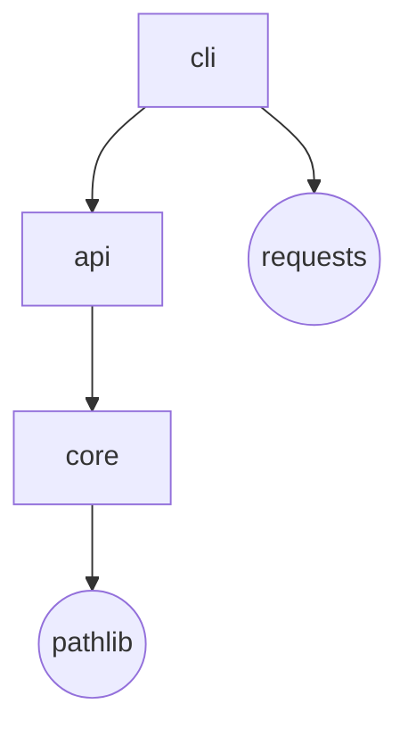

# index

> **See the shape of any codebase**: a repo-dependency graph + an interactive HTML dashboard, built from real code evidence — zero dependencies.

[](LICENSE)


[](https://github.com/HarperZ9/index-graph/actions/workflows/ci.yml)


`index` scans a workspace for Git repositories and renders a **dependency and topology graph** of them — as an interactive self-contained HTML dashboard, layered SVG, Mermaid, and a JSON context manifest. Every edge in the graph carries its own evidence (the file and line that witnesses it, plus a confidence grade). Output is deterministic; nothing to install beyond Python.

## 30-second quickstart

```bash
pip install index-graph
index viz --root /path/to/your/workspace --format html --out graph.html
open graph.html   # or: start graph.html on Windows
```

That produces a self-contained HTML file with an interactive dashboard: clickable nodes, layered layout, dependency lanes, and summary charts — no server, no assets, nothing to host.

To also write the raw JSON manifest:

```bash
index map --root /path/to/your/workspace --output INDEX.json
```

## What you get

| Output | Command | Description |
|--------|---------|-------------|
| **Interactive HTML dashboard** | `index viz --format html` | Self-contained; click nodes, explore layers and charts |
| **Layered SVG** | `index viz --format svg` | Static vector graph suitable for docs/CI artifacts |
| **Mermaid diagram** | `index viz --format mermaid` | Paste into GitHub markdown or any Mermaid renderer |
| **All three at once** | `index viz --format all --out-dir ./out` | Writes `graph.html`, `graph.svg`, `graph.mmd` |
| **JSON context manifest** | `index map` | Machine-readable inventory: remotes, branches, dirty counts, classification |
| **Dependency graph (text/JSON)** | `index graph` | Repo→repo edges with evidence; each edge carries its witness |
| **Context pack (prose + relations)** | `index context` | Synthesis pack: roles, relations, narrative summary |

## CLI reference

```
index map     [--root ROOT] [--output FILE] [--json] [--config CFG]
index graph   [--root ROOT] [--json]
index context [--root ROOT] [--focus REPO]
index viz     [--root ROOT] [--format {html,svg,mermaid,all}]
              [--focus REPO] [--no-external] [--out FILE] [--out-dir DIR]
```

`--focus REPO` narrows any render to a single repo's bidirectional dependency neighborhood.
`--no-external` hides stdlib/third-party nodes, keeping the graph to workspace repos only.

## Dependency graph example

Running `index viz --root ./my-workspace --format mermaid` produces a Mermaid flowchart where
workspace repos are rectangular nodes and external dependencies are rounded nodes:



Every `-->` edge in the real output carries the file (and line) that witnesses it.

## Configuration

Place an optional `.index.toml` at your workspace root to control classification rules,
which remotes to drop, and parallel worker count:

```toml
# .index.toml — at your workspace root
[[rule]]                  # classify repos by workspace-relative path; first match wins
pattern = "oss/**"
class   = "public"

[[rule]]
pattern = "work/**"
class   = "internal"

[scan]
jobs  = 16                    # parallel workers
prune = ["vendor", "target"]  # extra dirs to skip (added to the built-in safety set)

[privacy]
omit_origin_classes = ["internal"]   # drop remote URLs for repos in these classes

[output]
portable = true               # root-relative paths + hashed root (default on)
```

See [`example.index.toml`](example.index.toml) for the full schema and [`USAGE.md`](USAGE.md) for the
complete flag reference, the importable Python API, and worked examples with expected output.

## Guarantees

- **Evidence on every edge.** No edge appears in the graph without a file (and line) that witnesses it and a confidence grade (`high` when both a declared dependency and an observed import agree).
- **Deterministic output.** The same workspace produces the same JSON and renders every time.
- **Zero runtime dependencies.** Pure Python stdlib; nothing to install beyond Python 3.11+.
- **Portable maps.** Repository paths are root-relative; the local root is represented by a short hash; credential-shaped strings in remote URLs are always redacted.

## Install

```bash
pip install index-graph
```

Or from a checkout:

```bash
pip install -e .
```

## `index atlas` — code + knowledge map

`index atlas` renders a **two-layer** map: your repositories *and* their markdown
docs (READMEs, ADRs, design notes) as one explorable graph. Docs are first-class
nodes, `[[wiki-linked]]` and clustered onto the code they describe.

```bash
index atlas --root /path/to/workspace --format html --out atlas.html
```

Open `atlas.html` (one self-contained file, zero dependencies, no network): pan/zoom
the graph, search repos + docs, click a doc to read its rendered markdown with
clickable `[[links]]`, and double-click a node to focus its neighborhood. Edge types:
`describes` (doc→repo by location), `links-to` (`[[wiki]]`), and `mentions` (prose,
dimmest — toggle in the legend). `index atlas --json` emits the underlying pack.

See `examples/atlas-demo.html` for a rendered sample (`python examples/atlas_demo.py`).

---
**Zain Dana Harper** — small tools with explicit edges.
[Portfolio](https://harperz9.github.io) · [HarperZ9](https://github.com/HarperZ9)
<sub>Built with Claude Code; reviewed, tested, and owned by me.</sub>
